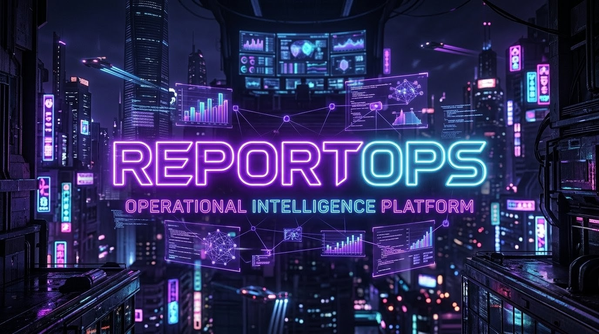

<p align="center">
  
</p>

<h1 align="center">ReportOps</h1>

<p align="center">
  Operational intelligence platform for collaborative CIS Benchmark reporting, lab VM orchestration, and automated audit evidence management.
</p>

<p align="center">
  <a href="https://github.com/LQH-coding-frenzy/Main_ReportOps_Project_Git/actions/workflows/ci.yml">
    
  </a>
  <a href="https://github.com/LQH-coding-frenzy/Main_ReportOps_Project_Git/actions/workflows/deploy.yml">
    
  </a>
  <a href="https://github.com/LQH-coding-frenzy/Main_ReportOps_Project_Git/actions/workflows/security.yml">
    
  </a>
  <a href="https://github.com/LQH-coding-frenzy/Main_ReportOps_Project_Git/actions/workflows/release.yml">
    
  </a>
  <a href="https://github.com/LQH-coding-frenzy/Main_ReportOps_Project_Git/actions/workflows/terraform.yml">
    
  </a>
  
</p>

<details>
  <summary><strong>Table of Contents</strong></summary>

  - [About the Project](#about-the-project)
  - [Key Features](#key-features)
  - [System Overview](#system-overview)
  - [Tech Stack](#tech-stack)
  - [Project Structure](#project-structure)
  - [GitHub Actions](#github-actions)
  - [Getting Started](#getting-started)
  - [Documentation](#documentation)
  - [Team](#team)
  - [Repository Status](#repository-status)
</details>

## About the Project

ReportOps is a private collaborative platform built for CIS Benchmark delivery workflows. It combines structured `.docx` authoring, role-governed report generation, GitHub-backed release publishing, and a newer automated audit pipeline that provisions lab VMs, runs security checks, archives evidence, and tracks operational results inside the same application.

The repository now covers two closely related tracks:

- Collaborative report editing with section-based ownership, ONLYOFFICE integration, preview builds, and final release freeze.
- Operational VM Ops workflows with Lab VM provisioning, OpenSCAP plus shell-script execution, selective remediation, not-applicable fixes, reverse remediation, evidence archiving, audit-pack management, and admin/auditor observability dashboards.

`project.answers.yaml` is the current source of truth for shared project metadata such as public URLs, benchmark labels, and infrastructure defaults.

## Key Features

- ✍️ Collaborative ONLYOFFICE editing for assigned CIS sections.
- 🔐 GitHub OAuth authentication with role-based access control.
- 🧩 Writing-guide aware report workflow to keep merged `.docx` output stable.
- 🚀 Preview builds and final report freeze flow with GitHub Releases integration.
- 🖥️ Lab VM lifecycle management driven by GitHub Actions and Terraform.
- 🛡️ VM Ops with OpenSCAP, uploaded shell scripts, selective remediation operations, and per-job evidence tracking.
- 🗃️ Archive views for artifacts, screenshots, raw logs, and execution evidence.
- 📊 Admin dashboards for audit packs, release settings, platform stats, and performance analytics.
- 🔍 Security automation with dependency audit, secret scanning, and CodeQL.

## System Overview

| Layer | Runtime / Service | Endpoint / Scope | Responsibility |
| --- | --- | --- | --- |
| Frontend | Next.js 16 App Router on Vercel | `https://automatedprogram.app` | UI, session-aware routing, API proxy, role-aware dashboards |
| Backend API | Express + Prisma on GCP VM | `https://api.automatedprogram.app/api` | Auth, report workflow, lab orchestration, audit/VM Ops/job APIs |
| Document Editing | ONLYOFFICE Document Server | `https://docs.automatedprogram.app` | Browser-based `.docx` editing and save callbacks |
| Data | Supabase Postgres + Storage | Managed service | App data, report files, archived evidence |
| Lab Automation | GitHub Actions + Terraform + GCP Compute Engine | Manual and app-triggered workflows | Create or destroy audit VMs and report status back to the app |
| Release Delivery | GitHub Releases | Repository and in-app release flows | Publish repository bundles and frozen report artifacts |

### Production Topology

- Frontend production deployment is handled by Vercel Git integration.
- Backend and ONLYOFFICE runtime are deployed from GitHub Actions to the GCP VM.
- Lab VM provisioning is executed by `terraform.yml` through `workflow_dispatch` or `repository_dispatch`.
- Final report releases created inside the app use `/api/releases/freeze` and are separate from repository source-package releases triggered by Git tags.

## Tech Stack

### Frontend


### Backend


### Data and Infra


### Automation


## Project Structure

```text
.
├── frontend/                    # Next.js 16 frontend deployed on Vercel
│   ├── src/app/                 # login, dashboard, guide, editor, reports, releases, lab, audit, archive, admin
│   ├── src/lib/                 # API client, project config, shared types
│   ├── public/                  # Static assets
│   └── .env.example             # Frontend env template
├── backend/                     # Express API, Prisma, GitHub release services, lab orchestration
│   ├── src/routes/              # auth, sections, editor, reports, releases, admin, audit-jobs, audit-scripts, lab
│   ├── src/services/            # report generation, ONLYOFFICE, GitHub releases, SSH websocket, storage
│   ├── src/config/              # env resolution and project.answers.yaml integration
│   ├── prisma/                  # Schema and seed
│   └── .env.example             # Backend env template
├── infra/
│   ├── onlyoffice/              # Docker Compose stack for Document Server
│   ├── terraform/               # Lab VM provisioning definitions
│   ├── deploy.sh                # Deployment helper
│   └── setup-vm.sh              # VM bootstrap helper
├── .github/workflows/           # CI, security, deploy, source releases, lab VM automation
├── database/                    # Database notes and supporting docs
├── scripts/                     # Team submission audit scripts (M1 real, M2-M4 placeholder)
├── manifests/                   # YAML manifests matching the M1-M4 packs
├── remediation/                 # VM Ops operation scripts kept separate from audit-only entrypoints
├── logs/                        # before/after command output captured for report evidence
├── screenshots/                 # M1-M4 screenshot buckets for final report assembly
├── project.answers.yaml         # Shared project metadata and defaults
├── WRITING_GUIDE.md             # Mandatory formatting guide for report authors
├── AGENTS.md                    # Repo-specific engineering context
└── README.md                    # This document
```

## GitHub Actions

| Workflow | Trigger | Current Responsibility |
| --- | --- | --- |
| `ci.yml` | Push and pull request on `main` / `develop` | Install, lint, and build both frontend and backend |
| `security.yml` | Push, pull request, weekly schedule | Dependency audit, TruffleHog secret scan, CodeQL analysis |
| `deploy.yml` | Push to `main` when backend, infra, project metadata, or canonical scripts/manifests/remediation change | Build backend, apply tracked Prisma migrations, import M1 runtime assets, deploy to GCP VM, restart ONLYOFFICE stack, verify `/api/health` |
| `terraform.yml` | `workflow_dispatch` and `repository_dispatch` | Provision or destroy Lab VMs and callback results into ReportOps |
| `release.yml` | Push tag matching `v*` | Publish repository source and deployment bundles for tagged versions |

### Workflow Notes

- Frontend production delivery is intentionally handled by Vercel Git integration, not by a GitHub Actions deploy workflow.
- `release.yml` is for repository source packages.
- In-app report publishing is a separate product workflow backed by `POST /api/releases/freeze` and the backend GitHub release service.

### Required GitHub Secrets

| Workflow | Secrets in Use |
| --- | --- |
| `deploy.yml` | `GCP_VM_HOST`, `GCP_VM_USER`, `GCP_VM_SSH_KEY`, `AUDIT_RUNNER_SSH_KEY`, `AUDIT_RUNNER_SSH_PUBLIC_KEY` |
| `terraform.yml` | `GCP_PROJECT_ID`, `GCP_SA_KEY`, `LAB_VM_SSH_KEYS`, `AUDIT_RUNNER_SSH_PUBLIC_KEY` |
| Backend release features | `GITHUB_TOKEN` in `backend/.env` for app-driven GitHub Release operations |

## Getting Started

### Prerequisites

- Node.js 20+
- npm
- Docker Desktop or Docker Engine with Compose support
- Supabase project for Postgres and Storage
- GitHub OAuth App for login
- Optional: GitHub token with repository write access for release publishing
- Optional: GCP credentials and GitHub secrets if you want to exercise deploy or lab automation workflows

### 1. Clone the repository

```bash
git clone https://github.com/LQH-coding-frenzy/Main_ReportOps_Project_Git.git
cd Main_ReportOps_Project_Git
```

### 2. Configure the backend

```bash
cd backend
cp .env.example .env
npm ci
npm run db:generate
npx prisma migrate deploy
npm run db:seed
npm run audit:bootstrap
npm run audit:import-m1
npm run dev
```

Important backend variables to review in `backend/.env`:

- `DATABASE_URL`
- `SUPABASE_URL`
- `SUPABASE_SERVICE_ROLE_KEY`
- `SUPABASE_STORAGE_BUCKET`
- `SUPABASE_ARCHIVE_BUCKET`
- `GITHUB_CLIENT_ID`
- `GITHUB_CLIENT_SECRET`
- `GITHUB_CALLBACK_URL`
- `ONLYOFFICE_DOCUMENT_SERVER_URL`
- `JWT_SECRET`
- `GITHUB_TOKEN` for report release publishing and deletion
- `AUDIT_RUNNER_SSH_KEY` and `AUDIT_RUNNER_SSH_PUBLIC_KEY` for production audit automation

If you launch the backend from outside the repository root, set `PROJECT_ANSWERS_PATH` so the server can still read `project.answers.yaml`.
`audit:bootstrap` registers the canonical M1-M4 packs, while `audit:import-m1` uploads the live 7-control M1 runtime scripts into storage and the database.

### 3. Configure the frontend

```bash
cd frontend
cp .env.example .env.local
npm ci
npm run dev
```

Frontend defaults resolve to the current production URLs when `NODE_ENV=production`, but local development is expected to use:

- Frontend: `http://localhost:3000`
- Backend API: `http://localhost:4000`
- ONLYOFFICE: `http://localhost:8080`

### 4. Start ONLYOFFICE locally (optional but recommended)

```bash
cd infra/onlyoffice
docker compose up -d
```

This enables the embedded editor flow used by `/editor/[sectionId]` and `/editor/report/[buildId]`.

### 5. Explore the current modules

- `/dashboard` for section ownership and report progress.
- `/guide` for the mandatory writing format guide.
- `/reports` and `/releases` for preview builds and frozen report releases.
- `/lab`, `/audit`, and `/archive` for the lab VM and VM Ops workflow.
- `/admin` for users, roles, sections, audit packs, logs, and release/settings governance.

## Documentation

- [`WRITING_GUIDE.md`](./WRITING_GUIDE.md) - required formatting rules for stable merged report output.
- [`AGENTS.md`](./AGENTS.md) - repository architecture, conventions, and deployment notes for collaborators and agents.
- [`project.answers.yaml`](./project.answers.yaml) - shared metadata and environment defaults.
- [`plan_complete.md`](./plan_complete.md) - current team scope, M1-M4 control split, and report submission structure.
- [`database/README.md`](./database/README.md) - database-specific notes.

## Team

| Member | Role | GitHub | Scope |
| --- | --- | --- | --- |
| Lại Quang Huy | Leader | `LQH-coding-frenzy` | M1: `1.2.1.2`, `1.1.2.1.2`, `1.1.2.1.3`, `1.1.2.1.4`, `1.5.1`, `1.5.2`, `2.3.1` |
| Bao Nguyên | Member | `baongdqu` | M2: `1.3.1.1`, `1.3.1.4`, `1.3.1.7`, `1.3.1.8`, `3.3.1`, `3.3.7`, `4.1.1` |
| Trương Duy | Member | `truongdaoanhduy` | M3: `5.1.1`, `5.1.15`, `5.1.19`, `5.1.20`, `5.1.22`, `5.2.2`, `5.2.6` |
| Lâm Hoàng Phước | Member | `hpuoc` | M4: `5.3.2.2`, `5.3.2.3`, `5.3.2.4`, `5.4.1.1`, `5.4.2.1`, `6.2.1.1`, `6.2.3.2` |

## Repository Status

- Visibility: private
- Context: UIT IoT academic project
- Benchmark focus: `CIS AlmaLinux OS 9 Benchmark v2.0.0` / `Level 1 - Server`
- Current public surfaces: `automatedprogram.app`, `api.automatedprogram.app`, `docs.automatedprogram.app`
