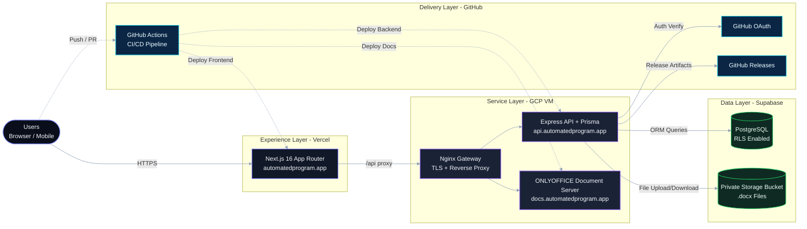
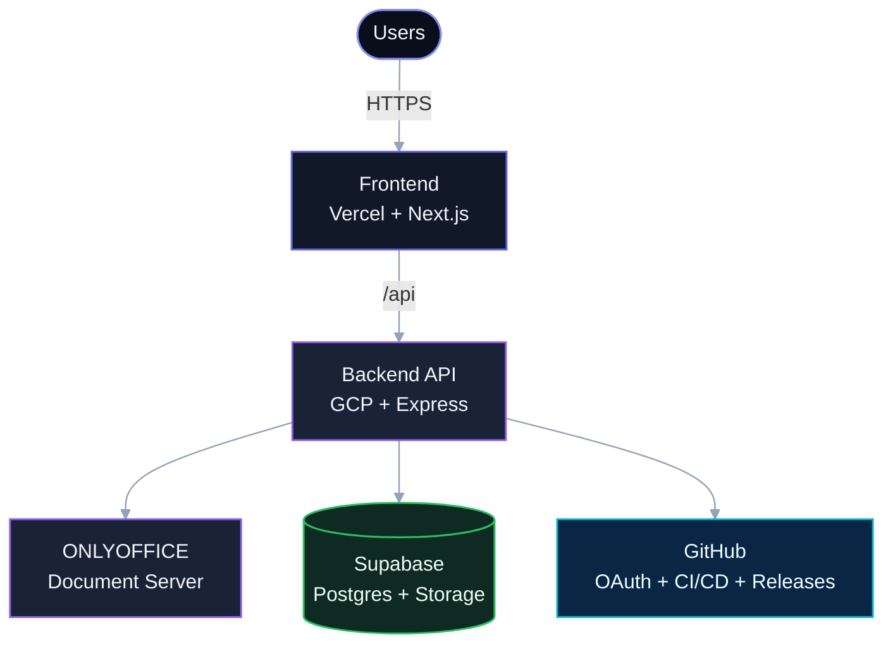

# 📋 ReportOps

> Nền tảng cộng tác viết báo cáo CIS Benchmark — CIS AlmaLinux OS 9 v2.0.0 Level 1 Server

[](https://github.com/LQH-coding-frenzy/Main_ReportOps_Project_Git/actions)

## ✨ Tính năng nổi bật

- 🔐 **GitHub OAuth** — Đăng nhập bảo mật qua GitHub
- ✏️ **ONLYOFFICE Editor** — Chỉnh sửa `.docx` trực tiếp với trải nghiệm gần như Microsoft Word
- 🛡️ **Hạ tầng bảo mật** — RLS (Supabase), Secret Scanning, Pre-commit Hooks
- 🤖 **CI/CD Automation** — Tự động kiểm tra, build và deploy khi push code lên GitHub
- 📊 **Auto Report Generation** — Tự động hợp nhất các section thành báo cáo tổng quát
- 🚀 **GitHub Releases** — Quản lý phiên bản và lưu trữ artifact chuyên nghiệp
- 🕵️ **Audit Logs** — Truy vết toàn bộ hành động chỉnh sửa của người dùng

## 🏗️ Architecture

> Production topology của ReportOps, đồng bộ visual language với website hiện tại.



### Architecture (Compact)

> Phiên bản rút gọn để xem nhanh trên mobile và GitHub preview.



### Ma trận kiến trúc

| Tầng | Runtime / Stack | Public Endpoint | Vai trò |
|---|---|---|---|
| Trải nghiệm | Vercel + Next.js 16 | `automatedprogram.app` | Giao diện người dùng, điều hướng, API proxy |
| Dịch vụ | GCP VM + Nginx + Express | `api.automatedprogram.app` | Xác thực, business logic, điều phối báo cáo |
| Tài liệu | GCP VM + ONLYOFFICE | `docs.automatedprogram.app` | Chỉnh sửa `.docx` thời gian thực |
| Dữ liệu | Supabase Postgres + Storage | Supabase managed service | Lưu trữ dữ liệu với RLS và file private |
| Phân phối | GitHub Actions + Releases | GitHub | CI/CD, quản lý phiên bản và release artifacts |

## 🌐 Môi trường Production

- **Website**: [https://automatedprogram.app](https://automatedprogram.app)
- **API Endpoint**: `https://api.automatedprogram.app`
- **Document Server**: `https://docs.automatedprogram.app`

---
## 🚀 Khởi động nhanh (Development)

### Điều kiện cần

- Node.js 20+
- Supabase project (free tier)
- GitHub OAuth App

### 1. Clone và cài đặt

```bash
git clone https://github.com/LQH-coding-frenzy/Main_ReportOps_Project_Git.git
cd Main_ReportOps_Project_Git
```

### 2. Cấu hình Backend

```bash
cd backend
cp .env.example .env
# Edit .env with your Supabase + GitHub OAuth credentials

npm install
npx prisma generate
npx prisma db push     # Push schema to Supabase
npm run db:seed        # Seed 4 users + 4 sections
npm run dev            # Start on http://localhost:4000
```

### 3. Cấu hình Frontend

```bash
cd frontend
cp .env.example .env.local
npm install
npm run dev            # Start on http://localhost:3000
```

### 4. ONLYOFFICE (Tùy chọn - để dùng editor)

```bash
cd infra/onlyoffice
docker compose up -d   # Start Document Server on http://localhost:8080
# Wait ~2 minutes for initialization
```

## 👥 Team

| Thành viên | Vai trò | Nhóm section | CIS Chapters |
|---|---|---|---|
| **Lại Quang Huy** | 👑 Leader | M1 | 1.1, 1.2, 1.4, 1.5, 1.6, 2.3, 2.4 |
| **Bao Nguyên** | Member | M2 | 1.3, 2.1, 2.2, 3, 4 |
| **Trương Duy** | Member | M3 | 5.1, 5.2, 5.3, 5.4 |
| **Lâm Hoàng Phước** | Member | M4 | 1.7, 1.8, 6, 7 |

## 🔑 Thiết lập môi trường

### GitHub OAuth App

1. Go to https://github.com/settings/developers
2. **New OAuth App**
3. Settings:
   - Name: `ReportOps`
   - Homepage: `http://localhost:3000`
   - Callback: `http://localhost:4000/api/auth/github/callback`
4. Copy Client ID & Secret to `backend/.env`

### Supabase

1. Create project at https://supabase.com
2. Go to Settings → Database → Connection string
3. Copy `DATABASE_URL` to `backend/.env`
4. Go to Settings → API → Copy `URL` and `service_role` key

## 📁 Cấu trúc dự án

```
├── frontend/               # Next.js 16 App Router
│   ├── src/app/           # Pages (login, dashboard, editor, reports, releases)
│   ├── src/lib/           # Types, API client
│   └── .env.example       # Frontend env template
│
├── backend/                # Express + Prisma
│   ├── src/routes/        # API routes (auth, sections, editor, reports, releases)
│   ├── src/services/      # Business logic (OAuth, ONLYOFFICE, storage, reports)
│   ├── src/middleware/     # Auth + RBAC middleware
│   ├── prisma/            # Schema + seed
│   └── .env.example       # Backend env template
│
├── infra/                  # Infrastructure
│   ├── onlyoffice/        # Docker Compose + Nginx
│   └── setup-vm.sh        # GCP VM setup script
│
└── .github/workflows/     # CI/CD (lint, security, release)
```

## 📖 API Endpoints

| Method | Path | Auth | Description |
|---|---|---|---|
| GET | `/api/auth/github/start` | — | OAuth redirect |
| GET | `/api/auth/github/callback` | — | OAuth callback |
| GET | `/api/auth/me` | ✅ | Current user |
| GET | `/api/sections` | ✅ | List sections |
| GET | `/api/editor/config/:id` | ✅ | ONLYOFFICE config |
| POST | `/api/onlyoffice/callback` | — | Save callback |
| POST | `/api/reports/preview` | 👑 | Build preview |
| POST | `/api/releases/freeze` | 👑 | Freeze release |
| GET | `/api/audit-logs` | 👑 | Audit logs |

## 🛠️ Hạ tầng và bảo mật

### CI/CD Pipeline
Dự án được triển khai tự động qua **GitHub Actions**:
- **Frontend**: Tự động build và deploy lên Vercel.
- **Backend**: SSH Deployment qua chuẩn `ed25519` bảo mật, tự động cập nhật Code, Restart PM2 và Docker Stack trên GCP VM.

### Biện pháp bảo mật
- **Row Level Security (RLS)**: Cấu hình trên Supabase để chặn mọi truy cập trái phép từ Client.
- **Git Hooks**: Pre-commit hook ngăn chặn vô tình commit file `.env` hoặc Private Key.
- **Secret Scanning**: Tự động quét và bảo vệ các chuỗi nhạy cảm trong Repo.

## 📜 License

Private — UIT IoT Team Project (Báo cáo Đồ Án)
- **Giảng viên hướng dẫn**: [Tên Giảng Viên]
- **Năm thực hiện**: 2026
